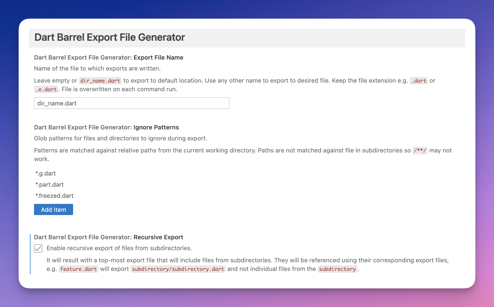

# Dart Barrel Export File Generator

[VS Code Extension](https://marketplace.visualstudio.com/items?itemName=orestesgaolin.dart-export-index)

## Features

This extension includes following commands:

- _Export Dart files in current directory export file_
  - export file name configurable in settings
  - can be run recursively
  - will create `export_file_name.dart` file exporting all the Dart files in the current directory e.g. `widgets.dart` if run within _widgets_ directory
- _Export (add) current Dart file to export file_ (export file name configurable in settings)
  - will add current file to `export_file_name.dart` in the current directory

## Extension Settings

This extension contributes the following settings:

- `dartBarrelExportFileGenerator.exportFileName`: export file name (default: `dir_name.dart`)
- `dartBarrelExportFileGenerator.recursiveExport`: iterate through directories recursively to create global export file (default: `false`)
- `dartBarrelExportFileGenerator.ignorePatterns`: ignore files (glob patterns)

## Source

Source code available on [GitHub](https://github.com/orestesgaolin/create-index).

This is a fork of [create-index](https://github.com/tsugitta/create-index).
